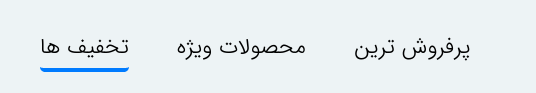

- همه css های inline رو به یک فایلی انتقال بده
- کد هایی اضافه هم حذف کن (کامنت ها و خصوصیاتی که پر نشدند)
- اندازه گیری بر اساس px نباشه pt یا rem
- المان های غیرضروری حذف شه!
- فوتر همه صفحات از صفحه about us ارث بری کنند
- اسکریپ های اضافه حذف بشه!
- تاجایی که امکان داره اسکریپ های توی فایلی جدا نوشته شوند

--------------------    

border hasho  bardar **::after** bede

--------------------
basket1.html > **درخواست پشتیبانی فوری** toye safhe bozorg kharab mishe.

-----------------
